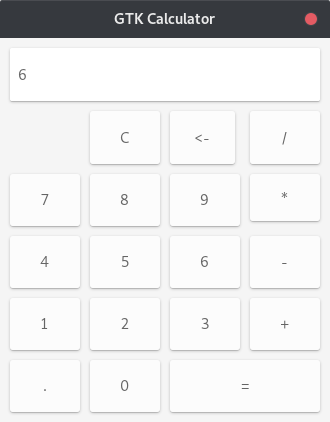

# GTK Calculator
A simple gtk calculator made in C.



## Requirements
* gtk 3
* gcc (tested on 8.3.1)
* cmake (tested on 3.14.4)

## How to compile
Make a new directory and run cmake on it.
```shell
$ mkdir build && cd build
$ cmake ../
```

After that, run make to create the binary.
```shell
$ make
```

Run the binary.
```shell
$ ./gtk-calculator
```
